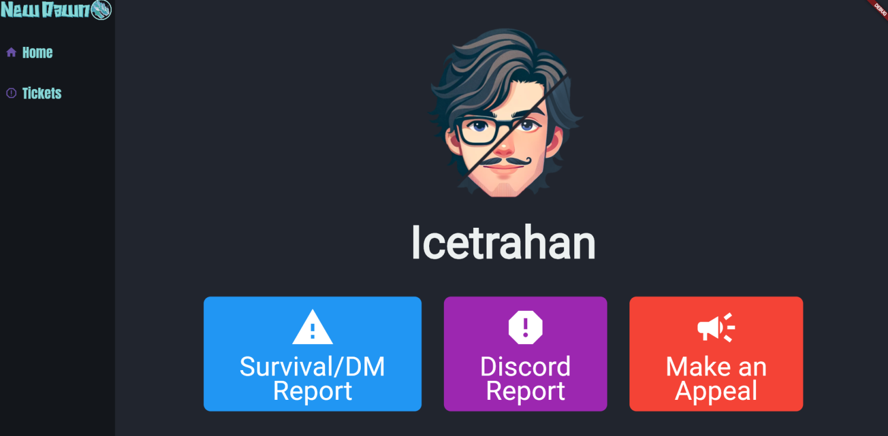
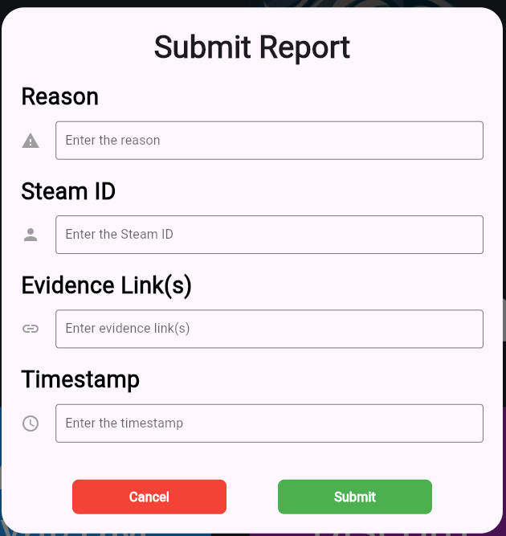
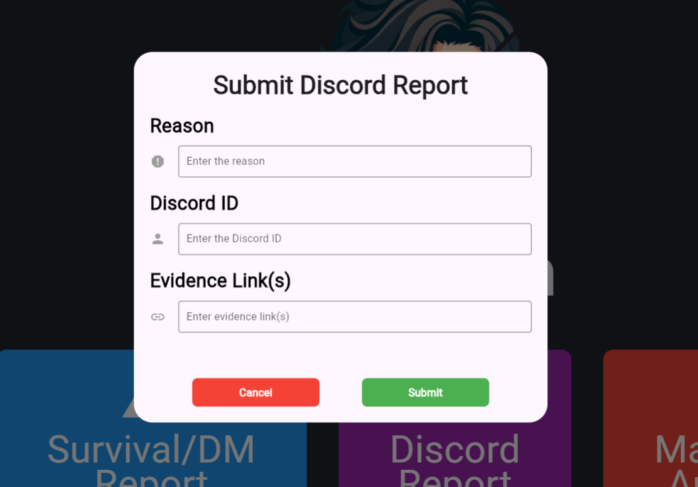

# Flutter Discord Admin Dashboard

A **Flutter-powered admin dashboard** designed to integrate with a **Flask API** and a **Discord bot** for ticket management.  
This app provides server staff with a centralized interface to track, update, and manage tickets without needing to stay inside Discord.  

---

## Features

- **Dashboard View**
  - View open and closed tickets
  - Filter and search tickets by user, status, or category  

- **Discord Bot Integration**
  - Syncs directly with a custom-built Discord bot
  - Pulls live ticket data via Flask API endpoints
  - Reflects ticket updates from Discord in real-time

- **Ticket Management**
  - Update ticket status (open, closed, in-progress)
  - Assign staff or roles to tickets
  - Add admin notes for context  

- **Cross-Platform**
  - Built in Flutter for **web, desktop, and mobile**  
  - Responsive layout for tablets and wide-screen dashboards  

---

## Tech Stack

- **Frontend:** Flutter (Dart)  
- **Backend API:** Flask (Python)  
- **Bot Integration:** Discord.py
- **Database:** MySQL or SQLite (via Flask API)  

